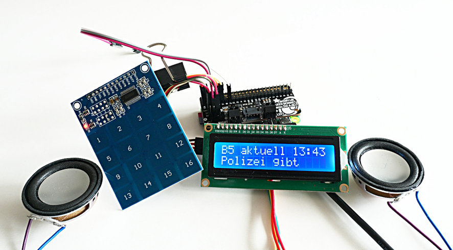

Simple Radio
============

This project implements a simple internet-radio using

  - a Raspberry Pi (or a similar SBC)
  - a TTP229-based keypad and/or
  - an infrared remote-control
  - a LCD-display (typically with 2-4 rows and 16-20 columns)

Basic features of the implementation:

  - select predefined radio-stations using the keypad/remote
  - display date and time and channel name on the display
  - display ICY-META data on the display
  - record a radio-channel (either unattended or on request)
  - playback recordings

Hardware prerequisites
----------------------

This project assumes that you have a basic installation of Raspbian
(or a similar OS, e.g. Armbian on other platforms). You should have
successfully configured sound. You should also know how to connect
a LCD display using the I2C-interface and the keypad to your Pi.
For the LCD you will find many tutorials on the net, for the keypad
you should head over to my
[pi-ttp229-keypad project](https://github.com/bablokb/pi-ttp229-keypad "keypad-project").

As an alternative for the keypad you can use a remote-control and
configure LIRC for it. There are also a lot of tutorials available on
how to configure LIRC for Raspbian.

If you connect your Pi using HDMI to a receiver, you can also use
CEC (Consumer Electronics Control). This delegates a number of commands
(volume, mute) directly to the receiver. See the section about CEC below.

Note: using only the recorder-part of the project does not require
the display and the keypad - even the configuration of the sound-system
is not necessary as long as you use a different system for playback. So
the recorder can be operated on a pure headless system.

Installation
------------

Use the following commands to install the software and all prerequisites:

    git clone https://github.com/bablokb/pi-ttp229-keypad.git
    cd pi-ttp229-keypad
    sudo tools/install
    cd ..

    git clone https://github.com/bablokb/simple-radio.git
    cd simple-radio
    sudo tools/install pi 27

The firt set of commands installs the code for the keypad, the second set
installs the code of this project. If your standard user is not `pi`,
you should pass a different name to the install command. The install command
also needs the number of the GPIO-pin of your LIRC installation. Even if
you do not use a remote, you have to provide this number.

Both installations will ask you to configure the software using the files
`/etc/ttp229-keypad.conf` and `/etc/simple-radio.conf` respectively.

If you want to use CEC, follow the additional installation instructions
below.

Configuration
-------------

The config-file of this project (`/etc/simple-radio.conf`) has a number of
sections. The meaning of the sections and variables should in general be
clear.

The `[GLOBAL]` section configures some basic properties. The section
`[DISPLAY]` lists the attributes (rows and columns) of your
display. Not every display has all the characters at the correct
code-points, you can use to translate characters to the correct
codepoint with the `trans`-variable:

    trans:  äöüßÄÖÜíáéè, e1,ef,f5,e2,e1,ef,f5,69,61,65,65

This variable holds a comma-separated list of strings. The first string
contains all special characters, the rest are the relevant replacement
code-points. For every character in the first string you need a
replacement point. The installation provides a little script `show_charset.py`,
this will display all code-points:

    show_charset.py 0 1 2 3

will display chars 0-15 and so on.

The section `[RECORD]` defines the default target-directory for recordings
and the default duration. Both values can be overriden on the commandline.
The default duration prevents that your SD-card is filled with a very
long recording in case you forget to stop the recording.

The `[KEYPAD]`-section defines the mapping of the 16 keys to predefined
commands. For every key, you can map the function in radio-mode and in
player-mode.

The example maps the first 8 keys to `switch_channel` in radio-mode, i.e.
key 5 will switch to channel number 5 (see below).

In player-mode, the keys trigger other functions, e.g. start/stop playing
or switching to the next recording.

The configuration file has a list of all available commands you can match
to the keys. Also see the section "Functions" below.

Finally, the `[LIRC]`-section maps LIRC-keynames to functions. Since remotes
typically have more keys, every key is only mapped to a single function.

Channel-file
------------

During startup, the program loads a simple list of radio-channels from
the file defined in variable `[GLOBAL] -> channel_file`. The default filename
is `/home/pi/simple-radio.channels` (replace `pi` with the name of your user
you passed to the install-command). The file should contain lines in
the format

    name@url

e.g.

    Bayern 3@http://br-br3-live.cast.addradio.de/br/br3/live/mp3/128/stream.mp3

Note the blank in the name-part (this is supported), but `name` should not
contain a `@`. The maximum length of `name` is 10 on a display with 16 columns
and 14 on a display with 20 columns.

The mapping to channel numbers is straightforward: the first line defines
channel 1, the second line channel 2 and so on.

The install-script copies a sample channel file from
`examples/simple-radio.channels` to the home-directory of the user passed
to the install-command. The sample channels-file contains a number
of public radio channels in Germany. Note that the URLs are not
stable and tend to change over time.

Functions
---------

The program implements a number of functions which can be mapped to keys:

| Function       | Description                                         |
| ---------------|-----------------------------------------------------|
| switch_channel | switch to channel (channel-number = key-number)     |
| prev_channel   | switch to previous channel                          |
| next_channel   | switch to next channel                              |
| toggle_record  | toggle recording, i.e. start or stop recording      |
| radio_off      | turn the radio off (a recording will continue)      |
| ---------------|-----------------------------------------------------|
| volume_down    | decrease volume                                     |
| toggle_mute    | toggle mute (not available with all sound-hardware) |
| volume_up      | increase volume                                     |
| ---------------|-----------------------------------------------------|
| start_playmode | switch to playback-mode                             |
| prev_recording | switch to the previous recording                    |
| toggle_play    | start or pause the currently selected recording     |
| next_recording | switch to the next recording                        |
| stop_play      | stop the current playback                           |
| exit_playmode  | switch back to radio-mode                           |
| ---------------|-----------------------------------------------------|
| reboot         | reboot the system                                   |
| restart        | restart the application                             |
| shutdown       | shutdown the system                                 |
| ---------------|-----------------------------------------------------|

Recordings
----------

Simple-radio supports ad-hoc recordings using the function `toggle_record`,
which is bound to key 15 in the default settings. During a recording,
you can switch to a different channel or turn the radio off (you should
not shut it down though). To prevent full sd-cards, the recording time
of ad-hoc recordings is limited by the value of the configuration-variable
`duration` in section `[RECORD]`.

Besides these ad-hoc recordings, simple-radio also supports recordings
in headless-mode directly from the commandline, e.g.

    simple-radio.py -r 4 120

will start to record channel "4" for 120 minutes. Using at or cron you
plan one-time or regular recordings, e.g.

    echo /usr/local/bin/simple-radio.py -r 4 120 | at 20:00

will start the recording today at 20:00. Note that "at" is not installed
by default on Raspbian.

For repeated recordings, you can use an entry within crontab, e.g.

     5 8 * * 7 pi /usr/local/bin/simple-radio.py -r 4 55

will record channel 4 for 55 minutes every Sunday at 08:05.

CEC-Support
-----------

The program uses CEC to delegate a number of functions (currently only
volume-up, volume-down and mute) to a receiver. Prerequisite is that
your Pi is attached to a receiver using HDMI and that you install
CEC-support.

The version of libcec installed by Raspbian (at least up to Stretch)
is not suitable, since it does not install the Python-wrappers. So
you must install libcec yourself.

First, you should remove the relevant packages if already installed
from the repository:

    sudo apt-get -y remove libcec cec-utils
    sudo apt-get -y autoremove

As a second step, you should edit the script `tools/mk-libcec` if you
compile on a Pi2 or Pi3. In this case, you should use the line
`make -j4` instead of just `make` (the third-last line in the script).

Download and compilation takes about a quarter of an hour on a Pi-Zero,
but this depends of course on the speed of your internet connection.

Once installed, you have to change the variable `cec` in section
`[GLOBAL]` within the configuration file `/etc/simple-radio.conf`. More
is not necessary. After a restart volume-changes should be delegated
to your receiver/TV.

A note on hacking:

CEC-support could be extended to more functions if the remote of your
receiver or TV has better CEC-integration. In this case, you should
start with the method `_process_key()` within the file
`files/usr/local/bin/SRCec.py`. Here you have to map keys to the
relevant functions of simple-radio. See file `files/usr/local/bin/SRKeypad.py`
(method `process_key()`) for a sample implementation.